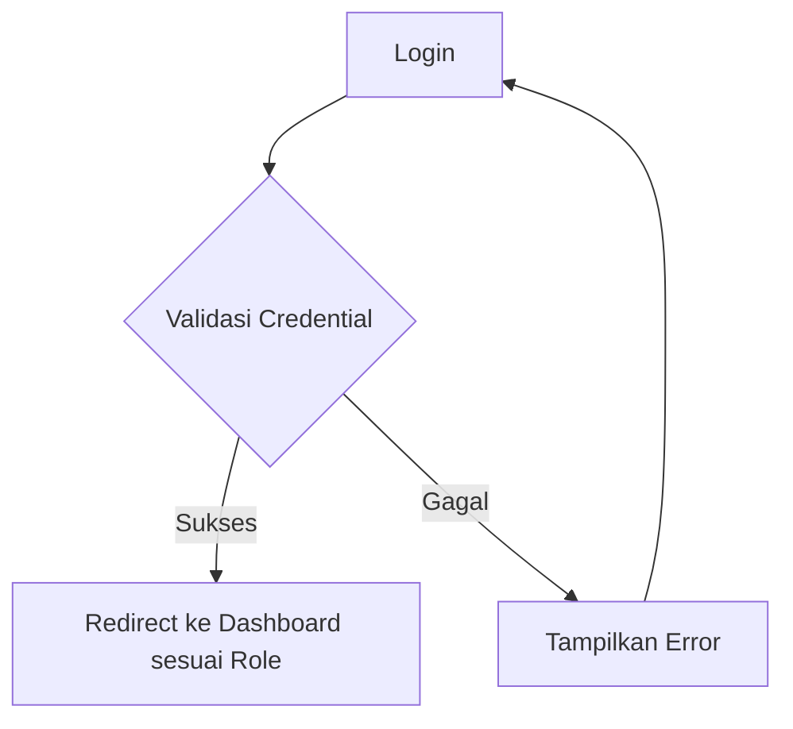

# Workflow Aplikasi Absensi Siswa dengan Next.js

## 1. Struktur Role Pengguna

### 1.1 Admin

- Mengelola data master (guru, kelas, siswa, mata pelajaran)
- Mengelola akun pengguna (admin dan guru)
- Melihat log aktivitas semua pengguna
- Membuat laporan absensi

### 1.2 Guru

- Melihat jadwal mengajar
- Melakukan absensi siswa
- Melihat riwayat absensi kelas yang diampu
- Membuat laporan absensi

## 2. Alur Autentikasi



## 3. Alur Admin

### 3.1 Dashboard Admin

- Tampilan ringkasan sistem
- Jumlah siswa, guru, kelas
- Aktivitas terbaru pengguna
- Statistik absensi

### 3.2 Manajemen Data Master

```
Admin --> Pilih Menu Data Master --> Pilih Jenis Data (Kelas/Guru/Siswa) --> Tampilkan List Data -->
Pilihan: Tambah/Edit/Hapus Data --> Form Input --> Validasi --> Simpan ke Database --> Tampilkan Notifikasi
semua fitur menggunakan modal, pencarian, paginasi, import export data dengan file excel, multi hapus data.
```

### 3.3 Manajemen Pengguna

```
Admin --> Pilih Menu Pengguna --> Pilih Jenis Pengguna (Admin/Guru) --> Tampilkan List Pengguna -->
Pilihan: Tambah/Edit/Hapus/Reset Password --> Form Input --> Validasi --> Simpan ke Database --> Tampilkan Notifikasi
```

### 3.4 Log Aktivitas

```
Admin --> Pilih Menu Log Aktivitas --> Tampilkan List Aktivitas -->
Filter: Berdasarkan Tanggal/Pengguna/Type Aktivitas --> Tampilkan Detail Log
```

## 4. Alur Guru

### 4.1 Dashboard Guru

- Tampilan jadwal mengajar hari ini
- Kelas yang akan diampu
- Notifikasi jika ada jadwal mengajar

### 4.2 Absensi Siswa

```
Guru --> Pilih Menu Absensi --> Pilih Tanggal & Kelas --> Tampilkan List Siswa -->
Pilih Status Kehadiran (Hadir/Izin/Sakit/Alpha) --> Simpan Absensi --> Tampilkan Konfirmasi
```

### 4.3 Riwayat Absensi

```
Guru --> Pilih Menu Riwayat Absensi --> Pilih Kelas --> Tampilkan List Absensi -->
Pilihan: Lihat Detail --> Tampilkan Data Absensi
```

## 5. Database Schema

### 5.1 Tabel Users

- id (primary key)
- username
- password (hashed)
- role (admin/guru)
- nama_lengkap
- email
- status
- no_wa
- created_at
- updated_at

### 5.2 Tabel Siswa

- id (primary key)
- nis
- nama_lengkap
- kelas_id
- jenis_kelamin
- created_at
- updated_at

### 5.3 Tabel Guru

- id (primary key)
- nip
- nama_lengkap
- mata_pelajaran_id
- no_wa
- created_at
- updated_at

### 5.4 Tabel Kelas

- id (primary key)
- nama_kelas
- tingkat_kelas
- tahun_ajaran
- created_at
- updated_at

### 5.5 Tabel Mata_Pelajaran

- id (primary key)
- kode_mapel
- nama_mapel
- created_at
- updated_at

### 5.6 Tabel Absensi

- id (primary key)
- siswa_id
- kelas_id
- tanggal
- status (hadir/izin/sakit/alpha)
- keterangan
- created_at
- updated_at

### 5.7 Tabel Log_Aktivitas

- id (primary key)
- user_id
- aktivitas
- detail
- ip_address
- user_agent
- created_at

## 6. Struktur Direktori Next.js

```
absensi-siswa/
├── components/           # Komponen UI reusable
│   ├── layout/
│   ├── dashboard/
│   ├── forms/
│   └── ui/
├── pages/               # Halaman Next.js
│   ├── api/             # API routes
│   ├── admin/           # Halaman admin
│   │   ├── laporan.js   # Halaman laporan absensi
│   ├── guru/            # Halaman guru
│   │   ├── absensi/
│   │   │   └── detail.js # Halaman detail absensi
│   │   └── riwayat-absensi.js # Halaman riwayat absensi
│   ├── auth/
│   ├── _app.js
│   └── index.js
├── lib/                 # Library dan utility functions
├── styles/              # File CSS/SCSS
├── public/              # File statis
├── models/              # Model database
└── middleware/          # Middleware
```

## 7. Fitur Keamanan

### 7.1 Autentikasi

- Login dengan username dan password
- Hash password menggunakan bcrypt
- JSON Web Token (JWT) untuk session management
- Middleware proteksi rute berdasarkan role

### 7.2 Otorisasi

- Role-based access control (RBAC)
- Validasi role sebelum mengakses fitur
- Proteksi endpoint API

### 7.3 Logging

- Mencatat semua aktivitas pengguna
- Menyimpan informasi teknis (IP, user agent)
- Audit trail untuk keperluan keamanan

## 8. Teknologi yang Digunakan

### 8.1 Frontend

- Next.js (React Framework)
- Tailwind CSS untuk styling
- React Query untuk data fetching
- Formik dan Yup untuk form validation

### 8.2 Backend

- Next.js API Routes
- SQLite (dapat diupgrade ke PostgreSQL/MySQL)
- Prisma sebagai ORM
- JWT untuk autentikasi

### 8.3 Tools

- ESLint dan Prettier (code formatting)
- Husky dan lint-staged (pre-commit hooks)

---

### Ringkasan Pekerjaan Hari Ini

Hari ini kita telah menyelesaikan banyak hal penting, terutama berfokus pada penyempurnaan fitur yang sudah ada dan mengaktifkan pencatatan aktivitas:

1.  **Penyempurnaan *Dashboard* Admin:**
    *   Menambahkan statistik "Pengajuan Tertunda" ke *dashboard*.
    *   Menampilkan daftar "Pengajuan Siswa Tertunda Terbaru" di *dashboard* admin.
    *   Menambahkan *badge* notifikasi di *sidebar* admin untuk pengajuan tertunda.
2.  **Aktivasi Log Aktivitas Pengguna:**
    *   Mengintegrasikan pencatatan log untuk berbagai aktivitas penting di *backend*, termasuk:
        *   *Login* Admin dan Guru (berhasil dan gagal).
        *   Pengiriman Absensi Siswa oleh Guru.
        *   Pengajuan Pindah/Hapus Kelas Siswa oleh Guru.
        *   Pemrosesan Pengajuan Siswa oleh Admin (diterima/ditolak).
        *   Penambahan, Pembaruan, dan Penghapusan Jadwal oleh Admin dan Guru.
        *   Pembuatan Laporan Absensi oleh Admin.
3.  **Fitur Pengajuan Siswa Pindah/Hapus Kelas:**
    *   Memindahkan fungsionalitas pengajuan ke halaman absensi guru, memungkinkan pengajuan multi-siswa.
    *   Mengimplementasikan *modal* pengajuan dan API *backend* untuk pengajuan massal.
    *   Menyelesaikan logika pemrosesan pengajuan di sisi admin, termasuk pembaruan kelas siswa untuk "pindah kelas" dan penghapusan data siswa untuk "hapus kelas".
4.  **Penyempurnaan Laporan Absensi Admin:**
    *   Menambahkan opsi "Ekspor ke PDF" di halaman laporan.
    *   Mengintegrasikan `kopsurat.png` ke dalam hasil cetak PDF.
    *   Melakukan beberapa iterasi perbaikan CSS cetak untuk tata letak yang lebih rapi, ukuran *font* yang optimal, penghapusan *border*, dan memastikan semua kolom (termasuk "% Kehadiran" dan nomor urut) terlihat dengan baik.
    *   Menambahkan nomor urut pada tabel laporan.
5.  **Perbaikan *Bug* dan Refinement:**
    *   Memperbaiki berbagai *runtime error* dan *syntax error* yang muncul selama pengembangan.
    *   Memperbaiki *path import* yang salah.
    *   Menyempurnakan responsivitas *layout* guru dan tampilan nama guru di *header*.
    *   Menyelesaikan konflik *merge* Git.

---

### Pembaruan *Workflow* (Belum Selesai)

Berdasarkan *workflow* yang ada dan fitur yang kita diskusikan, berikut adalah beberapa area yang masih bisa dikembangkan di masa mendatang:

*   **Notifikasi *Real-time* (WebSockets):** Notifikasi pengajuan baru saat ini menggunakan *polling* (mendekati *real-time*). Untuk pembaruan instan, implementasi WebSockets diperlukan, yang merupakan perubahan signifikan pada arsitektur *backend* dan *frontend*.
*   **Pengelolaan Data Master Lainnya:** Meskipun kerangka kerja sudah ada, kita tidak secara spesifik menyentuh semua halaman manajemen data master (misalnya, Siswa, Guru, Mata Pelajaran) untuk memastikan semua fungsionalitas CRUD, impor/ekspor, dan penghapusan massal berfungsi optimal setelah perubahan skema dan API.
*   **Riwayat Absensi Guru:** Halaman riwayat absensi guru (`/guru/riwayat-absensi`) belum disentuh secara spesifik untuk penyempurnaan.
*   **Pengelolaan Pengguna Admin:** Fungsionalitas manajemen pengguna oleh admin belum diperiksa secara mendalam.
*   **Pengujian Komprehensif:** Semua fitur baru dan perubahan yang telah kita lakukan memerlukan pengujian menyeluruh untuk memastikan stabilitas dan keandalan.
*   **Pembaruan Prisma:** Ada peringatan tentang versi Prisma yang sudah usang. Memperbarui Prisma ke versi terbaru dapat memberikan fitur dan perbaikan *bug* baru.