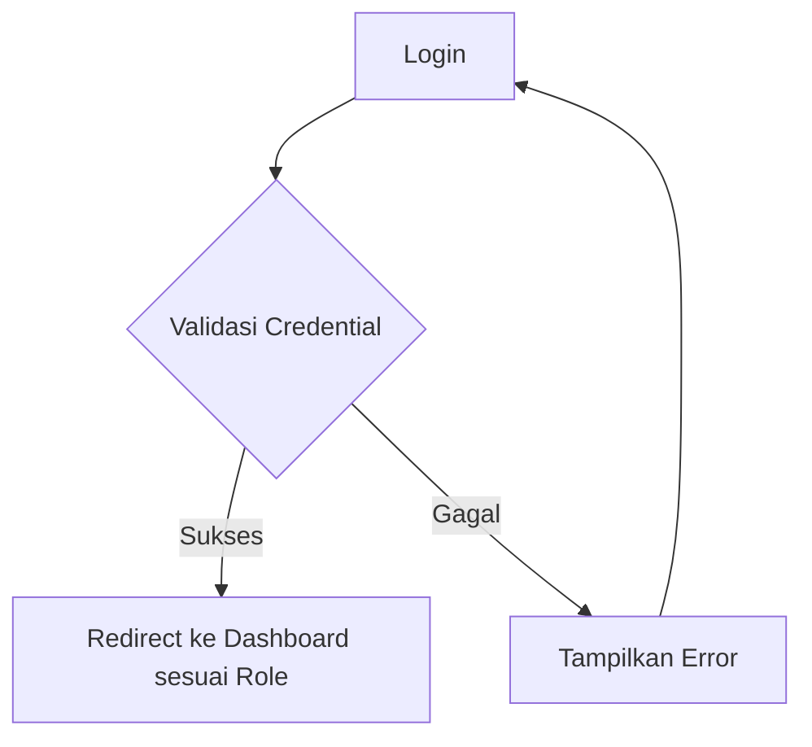

# Workflow Aplikasi Absensi Siswa

## 1. Struktur Role Pengguna

### 1.1 Admin
- Mengelola data master (siswa, guru, kelas, mata pelajaran)
- Mengelola akun pengguna (admin dan guru)
- Melihat log aktivitas semua pengguna
- Membuat laporan absensi

### 1.2 Guru
- Melihat jadwal mengajar
- Melakukan absensi siswa
- Melihat riwayat absensi kelas yang diampu
- Membuat laporan absensi

## 2. Alur Autentikasi



## 3. Alur Admin

### 3.1 Dashboard Admin
- Tampilan ringkasan sistem
- Jumlah siswa, guru, kelas
- Aktivitas terbaru pengguna
- Statistik absensi

### 3.2 Manajemen Data Master
```
Admin --> Pilih Menu Data Master --> Pilih Jenis Data (Siswa/Guru/Kelas/Mata Pelajaran) --> Tampilkan List Data --> 
Pilihan: Tambah/Edit/Hapus Data --> Form Input --> Validasi --> Simpan ke Database --> Tampilkan Notifikasi
```

### 3.3 Manajemen Pengguna
```
Admin --> Pilih Menu Pengguna --> Pilih Jenis Pengguna (Admin/Guru) --> Tampilkan List Pengguna --> 
Pilihan: Tambah/Edit/Hapus/Reset Password --> Form Input --> Validasi --> Simpan ke Database --> Tampilkan Notifikasi
```

### 3.4 Log Aktivitas
```
Admin --> Pilih Menu Log Aktivitas --> Tampilkan List Aktivitas --> 
Filter: Berdasarkan Tanggal/Pengguna/Type Aktivitas --> Tampilkan Detail Log
```

## 4. Alur Guru

### 4.1 Dashboard Guru
- Tampilan jadwal mengajar hari ini
- Kelas yang akan diampu
- Notifikasi jika ada jadwal mengajar

### 4.2 Absensi Siswa
```
Guru --> Pilih Menu Absensi --> Pilih Tanggal & Kelas --> Tampilkan List Siswa --> 
Pilih Status Kehadiran (Hadir/Izin/Sakit/Alpha) --> Simpan Absensi --> Tampilkan Konfirmasi
```

### 4.3 Riwayat Absensi
```
Guru --> Pilih Menu Riwayat Absensi --> Pilih Kelas & Periode --> Tampilkan List Absensi --> 
Pilihan: Lihat Detail/Edit --> Tampilkan Data Absensi --> Pilihan: Export/Cetak
```

## 5. Database Schema

### 5.1 Tabel Users
- id (primary key)
- username
- password (hashed)
- role (admin/guru)
- nama_lengkap
- email
- status
- created_at
- updated_at

### 5.2 Tabel Siswa
- id (primary key)
- nis
- nama_lengkap
- kelas_id
- tanggal_lahir
- alamat
- no_telp
- created_at
- updated_at

### 5.3 Tabel Guru
- id (primary key)
- nip
- nama_lengkap
- mata_pelajaran_id
- alamat
- no_telp
- created_at
- updated_at

### 5.4 Tabel Kelas
- id (primary key)
- nama_kelas
- tingkat_kelas
- tahun_ajaran
- created_at
- updated_at

### 5.5 Tabel Mata_Pelajaran
- id (primary key)
- kode_mapel
- nama_mapel
- created_at
- updated_at

### 5.6 Tabel Absensi
- id (primary key)
- siswa_id
- kelas_id
- tanggal
- status (hadir/izin/sakit/alpha)
- keterangan
- created_at
- updated_at

### 5.7 Tabel Log_Aktivitas
- id (primary key)
- user_id
- aktivitas
- detail
- ip_address
- user_agent
- created_at

## 6. Fitur Keamanan

### 6.1 Autentikasi
- Login dengan username dan password
- Hash password menggunakan bcrypt
- Token JWT untuk session management

### 6.2 Otorisasi
- Role-based access control (RBAC)
- Validasi role sebelum mengakses fitur
- Proteksi endpoint API

### 6.3 Logging
- Mencatat semua aktivitas pengguna
- Menyimpan informasi teknis (IP, user agent)
- Audit trail untuk keperluan keamanan

## 7. Teknologi yang Digunakan

### 7.1 Backend
- Node.js
- Express.js
- SQLite (dapat diupgrade ke PostgreSQL/MySQL)
- JWT untuk autentikasi

### 7.2 Frontend
- HTML5
- CSS3 (Bootstrap 5)
- JavaScript (Vanilla JS)
- Chart.js untuk visualisasi data

### 7.3 Tools
- Nodemon (development)
- Postman (testing API)